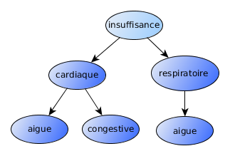
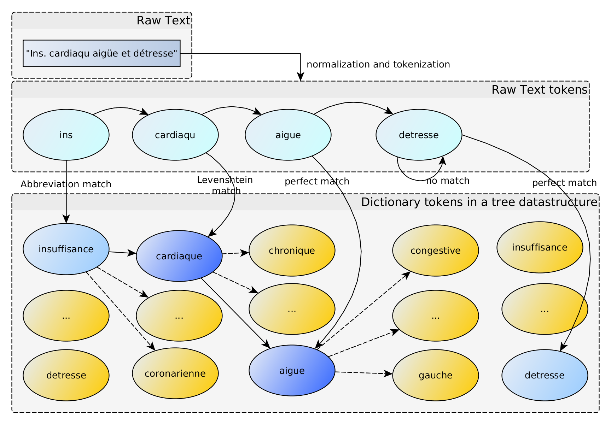

# IAMsystem

A dictionary-based approach for semantic annotation, a.k.a [entity linking](https://en.wikipedia.org/wiki/Entity_linking). 

Semantic annotation is the process of finding mappings between text chunks and the concepts of a terminology. 

IAMsystem scales linearly O(n) with n the number of tokens in a document. It doesn't depend on the number of terms in the terminology nor the number of tokens per term. 
  
The terminology is stored in a tree data structure ([a trie](https://en.wikipedia.org/wiki/Trie)) for low memory storage and fast lookup (O(1)): 



It can handle abbreviations and typos (with Levenshtein distance) dynamically at the token level.



Brat output is available. 


## Getting started

Add the dependency to your pom.xml to download it from the Maven Repository:

```XML
<dependency>
 	<groupId>fr.erias</groupId>
	<artifactId>IAMsystem</artifactId>
	<version>1.2.0</version>
</dependency>
```

To build it, you will need Java 1.8 (or higher) JDK a recent version of Maven (https://maven.apache.org/download.cgi) and put the `mvn` command on your path. Now you can run `mvn clean install` in the IAMsystem folder to compile the project. 

## Quick start
```java
// Initiate TermDetector
TermDetector termDetector = new TermDetector();
// add terms from a terminology manually or by loading a CSV file
termDetector.addTerm("high blood pressure", "I10");
termDetector.addTerm("fever", "R50.9");
// add abbreviations (optional)
Abbreviations abbreviations = new Abbreviations();
termDetector.addSynonym(abbreviations);
abbreviations.addAbbreviation("blood pressure", "bp");
// detect
String inputString = "The patient denied any fever and has high BP.";
DetectOutput detectOutput = termDetector.detect(inputString);
System.out.println(detectOutput.toString());
// fever and high BP detected
```

See how it works by loading the Maven project in the example folder using your favorite IDE.  
If you notice a problem, please open an issue.

## Reference
*    Cossin S, Jouhet V, Mougin F, Diallo G, Thiessard F. IAM at CLEF eHealth 2018: Concept Annotation and Coding in French Death Certificates. https://arxiv.org/abs/1807.03674
*    Cossin S and Jouhet V. IAM at CLEF eHealth 2020: Concept Annotation in Spanish Electronic Health Records.  http://www.dei.unipd.it/~ferro/CLEF-WN-Drafts/CLEF2020/paper_198.pdf

### Release note:

| Version    |                                                                                                        |
|------------|--------------------------------------------------------------------------------------------------------|
|   0.0.1    | First publication of the algorithm (November 2018)                                                     |
|   1.0.0    | First major modification. Change the output object of the detector (December 2020), add TermDetector   |
|   1.2.0    | Re-implement the trie and add a cache mechanism to improve performance                     		      |

## Demo
*    Detect French UMLS concepts: https://www.erias.fr/detectUMLS/
*    Detect Spanish ICD-10 diagnosis and procedure: https://www.erias.fr/codiesp/

## Call it from R
See https://github.com/scossin/RIAMsystem

## Handles context (negation...) with FastContext
See https://github.com/scossin/IAMsystemFastContext


## Acknowledgement
This annotation tool is part of the Drugs Systematized Assessment in real-liFe Environment (DRUGS-SAFE) research platform that is funded by the French Medicines Agency (Agence Nationale de Sécurité du Médicament et des Produits de Santé, ANSM). This platform aims at providing an integrated system allowing the concomitant monitoring of drug use and safety in France.

